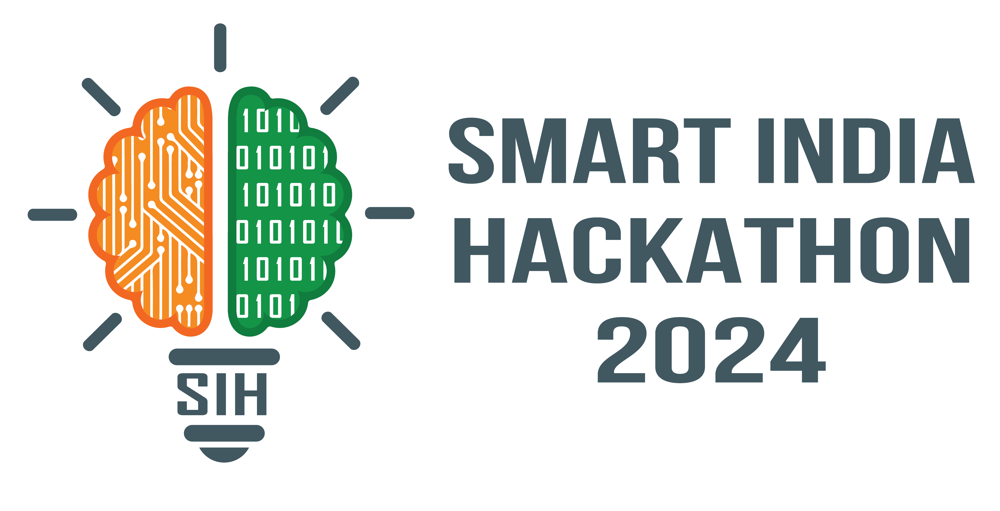
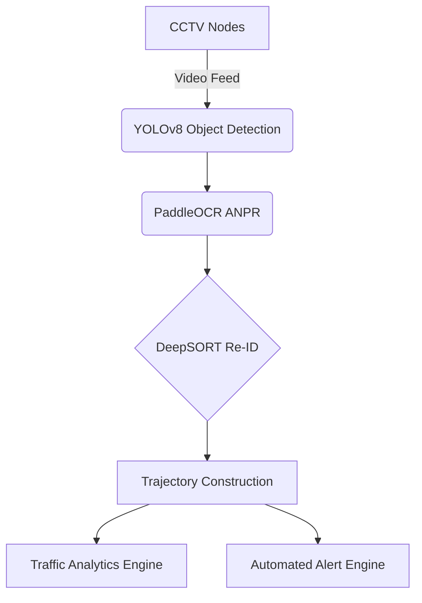

<div align="center">
  
  
  <br />
  <br />

  <h1>🚦 City-Wide AI Traffic Intelligence Engine</h1>
  <p>
    <strong>A Premium Multi-Camera ANPR Trajectory Tracking & Urban Traffic Analytics Platform</strong>
  </p>

  <p>
    <a href="#-overview">Overview</a> •
    <a href="#-key-capabilities">Features</a> •
    <a href="#-architecture">Architecture</a> •
    <a href="#-technology-stack">Tech Stack</a> •
    <a href="#-getting-started">Installation</a>
  </p>
</div>

---

## 📖 Overview

The **City-Wide AI Traffic Intelligence Engine** is an enterprise-grade command centre software designed to monitor urban mobility, detect traffic anomalies, and reconstruct vehicle trajectories across multiple disparate camera nodes.

Built specifically for the **Smart India Hackathon (SIH)**, this prototype demonstrates a robust implementation of cross-camera vehicle tracking using simulated Automatic Number Plate Recognition (ANPR) and spatio-temporal matching logic.

## ✨ Key Capabilities

- **🎥 Live Multi-Node Surveillance**: Monitor real-time CCTV feeds across the city with dynamic bounding boxes and vehicle identification overlays.
- **🚗 Cross-Camera Vehicle Tracking**: Select any detected vehicle to reconstruct its complete journey across the city grid, deduplicating consecutive detections.
- **📊 Urban Traffic Analytics**: Real-time traffic volume flow, average speed aggregation, and dynamic congestion status (LOW/MEDIUM/HIGH) calculated per camera node.
- **🚨 Automated Alert Engine**: Intelligent real-time alerts for high-speed vehicles, sudden congestion spikes, and unusual route transitions.
- **🌃 Premium Command Centre UI**: A dark, restrained, enterprise-grade interface utilizing genuine Indian urban traffic imagery for a highly realistic SIH presentation.

## 🏗️ Architecture

The theoretical architecture for this system represents a modern Edge-to-Cloud vision pipeline. *(Note: The current prototype uses a realistic tick-based data simulation engine to emulate this pipeline for SIH demonstration purposes).*



## 💻 Technology Stack

### Frontend
- **React.js 19** with **Vite**
- **TypeScript**
- **Tailwind CSS v4** (Custom CSS Variables & Theme)
- **Recharts** for Analytics Visualizations
- **React-Leaflet** for Map Trajectories
- **Lucide React** for UI Icons

### Backend
- **Python 3.10+**
- **FastAPI**
- **Pydantic** for Strict Data Validation
- **Uvicorn** ASGI Server
- **Asyncio** for Real-Time Simulation Ticks

## 🚀 Getting Started

### Prerequisites
- Node.js (v18+)
- Python 3.10+

### 1. Start the Backend Simulation Engine
```bash
cd backend
python -m venv venv
source venv/Scripts/activate  # On Windows
pip install fastapi[standard] pydantic uvicorn
uvicorn main:app --reload --port 8000
```

### 2. Start the Frontend Command Dashboard
```bash
cd frontend
npm install
npm run dev
```

Visit `http://localhost:5173` to view the application.

## 🎬 SIH Demo Guide

To effectively pitch this to the SIH judges, follow this workflow:
1. Navigate to the **Command Dashboard** and point out the live updating KPIs and traffic flow.
2. Go to **Live Cameras** to show the simulated bounding boxes over realistic Indian traffic nodes.
3. Click **Track This Vehicle** on any detected car (e.g., `DL01AB1234`).
4. Show the **Vehicle Tracking** map and the clean, deduplicated cross-camera timeline journey.
5. Demonstrate the **Traffic Analytics** flow charts updating in real-time.
6. Navigate to **System Alerts** and resolve a few active alerts to demonstrate the system's operational readiness.

---
<div align="center">
  <i>Developed with ❤️ for Smart India Hackathon</i>
</div>
