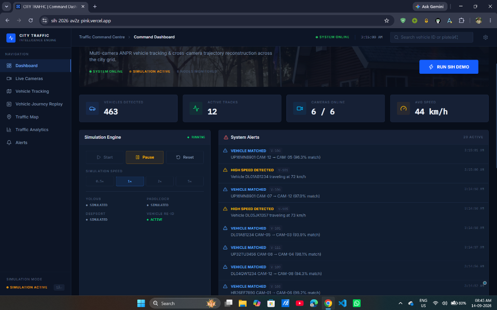
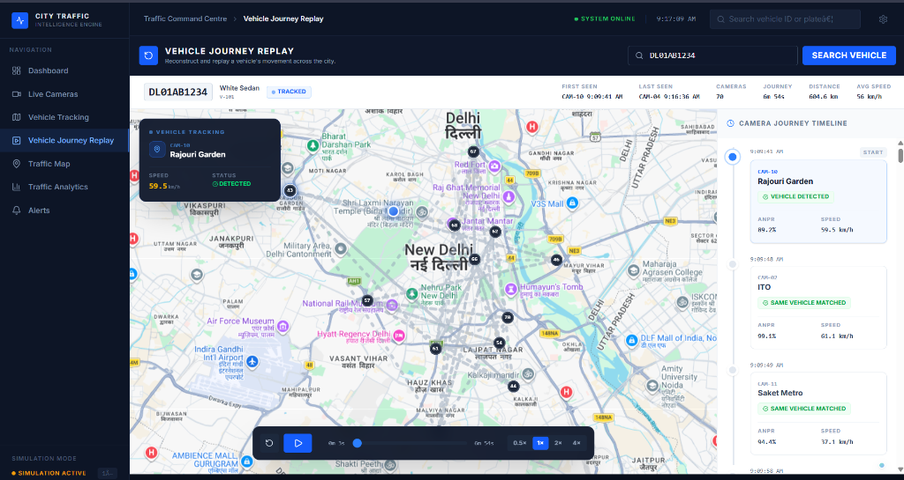
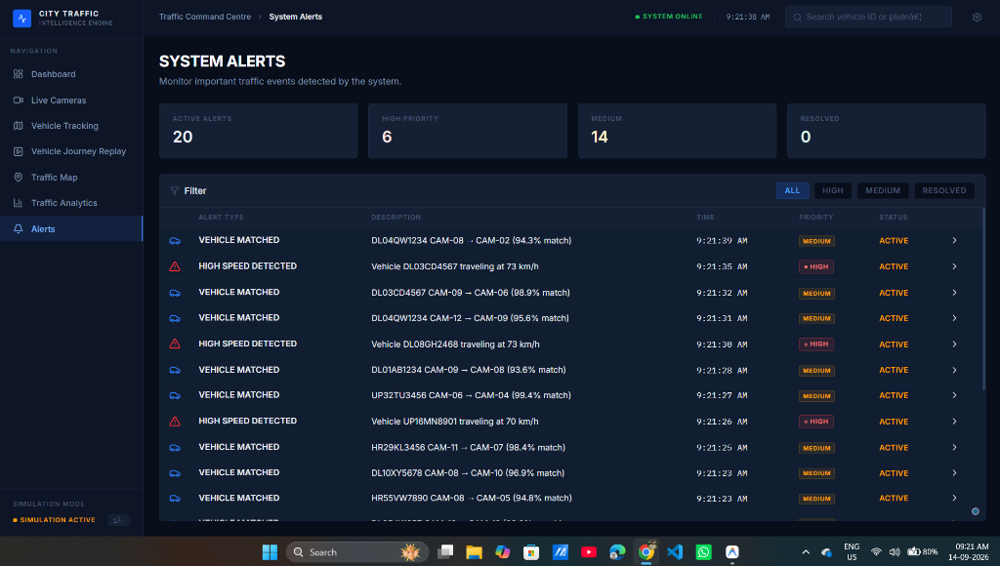
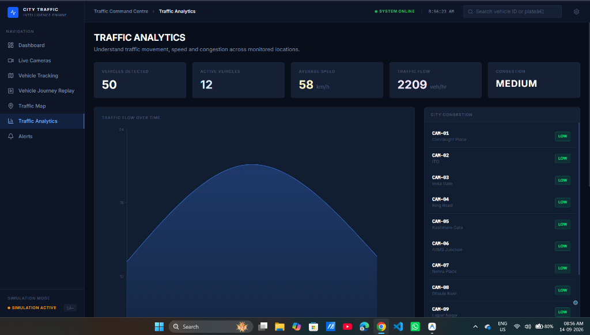
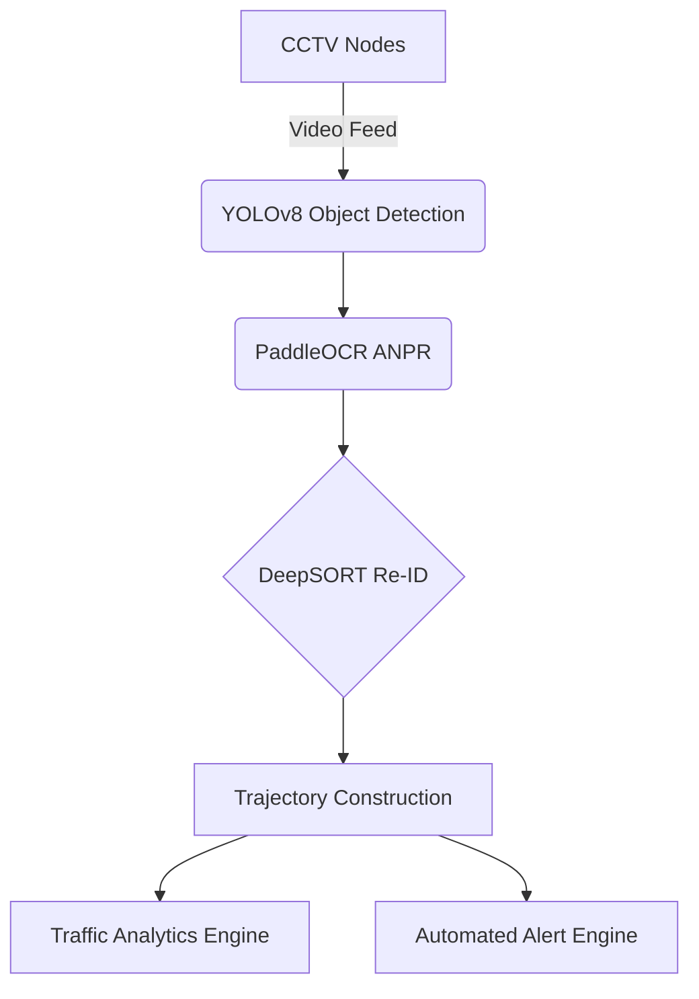

<div align="center">
  
  
  <br />
  <h2 style="color: #64748b; font-weight: 800; letter-spacing: 0.1em; text-transform: uppercase;">Smart India Hackathon 2026</h2>

  <h1>🚦 City-Wide AI Traffic Intelligence Engine</h1>
  <p>
    <strong>A Premium Multi-Camera ANPR Trajectory Tracking & Urban Traffic Analytics Platform</strong>
  </p>

  <p>
    <a href="#-overview">Overview</a> •
    <a href="#-key-features">Features</a> •
    <a href="#-architecture">Architecture</a> •
    <a href="#-technology-stack">Tech Stack</a> •
    <a href="#-getting-started">Installation</a>
  </p>

  <br />
  
</div>

---

## 📖 Overview

The **City-Wide AI Traffic Intelligence Engine** is an enterprise-grade command centre software designed to monitor urban mobility, detect traffic anomalies, and reconstruct vehicle trajectories across multiple disparate camera nodes.

Built specifically for the **Smart India Hackathon (SIH) 2026**, this prototype demonstrates a robust implementation of cross-camera vehicle tracking using simulated Automatic Number Plate Recognition (ANPR) and spatio-temporal matching logic.

## ✨ Key Features

### 🎬 Cinematic Vehicle Journey Replay
Reconstruct and replay a vehicle's movement across the city with a stunning, premium map interface utilizing high-resolution Google Maps satellite/road tiles. 
- **Glowing Trajectory Trails:** Deep blue shadows and bright cores create a highly visible, professional tracking aesthetic.
- **Auto-Scrolling Journey Timeline:** As the vehicle physically drives across the map, the timeline log smoothly auto-scrolls to keep the active camera centered, creating a synchronized live-feed experience.
- **Dynamic Playback Control:** Play, pause, and scrub through the vehicle's historical path with 0.5x to 4x cinematic speed control.

<div align="center">
  
</div>

### 🚨 Real-Time Automated Alert Engine
An intelligent event loop detects high-speed vehicles, sudden congestion spikes, and unusual route transitions instantly.
- **High-Capacity Queue:** Capable of buffering and displaying up to 500 active alerts simultaneously without locking up.
- **Interactive Resolution:** Operators can click on any alert to instantly view the camera node, track the offending vehicle, or mark the incident as resolved.

<div align="center">
  
</div>

### 📊 Live Urban Traffic Analytics
Aggregates vast amounts of vehicle detection data into digestible, real-time charts.
- **Volume & Flow Rates:** Real-time traffic volume flow (Vehicles per Hour) calculated dynamically per camera node.
- **Congestion Heat:** Intelligent algorithmic assessment of LOW/MEDIUM/HIGH congestion based on live average speed tracking.

<div align="center">
  
</div>

### 🎥 Multi-Node Live Surveillance
Monitor real-time CCTV feeds across the city with dynamic bounding boxes and vehicle identification overlays. A globally synchronized, monotonic loading engine guarantees seamless, jump-free progress bars as the live feeds initialize.

## 🏗️ Architecture

The theoretical architecture for this system represents a modern Edge-to-Cloud vision pipeline. *(Note: The current prototype uses a realistic tick-based Python data simulation engine to emulate this pipeline for SIH demonstration purposes).*



## 💻 Technology Stack

### Frontend
- **React.js 19** with **Vite**
- **TypeScript**
- **Tailwind CSS v4** (Custom CSS Variables & Theme)
- **Recharts** for Analytics Visualizations
- **React-Leaflet** for Map Trajectories (with Google Maps Tile Integration)
- **Lucide React** for UI Icons

### Backend
- **Python 3.10+**
- **FastAPI**
- **Pydantic** for Strict Data Validation
- **Uvicorn** ASGI Server
- **Asyncio** for Real-Time Simulation Ticks

## 🚀 Getting Started

### Prerequisites
- Node.js (v18+)
- Python 3.10+

### 1. Start the Backend Simulation Engine
```bash
cd backend
python -m venv venv
source venv/Scripts/activate  # On Windows
pip install fastapi[standard] pydantic uvicorn
uvicorn main:app --reload --port 8000
```

### 2. Start the Frontend Command Dashboard
```bash
cd frontend
npm install
npm run dev
```

Visit `http://localhost:5173` to view the application.

## 🎬 SIH Demo Guide

To effectively pitch this to the SIH judges, follow this workflow:
1. Navigate to the **Command Dashboard** and point out the live updating KPIs and traffic flow.
2. Go to **Live Cameras** to show the simulated bounding boxes over realistic Indian traffic nodes.
3. Click **Track This Vehicle** on any detected car (e.g., `DL01AB1234`).
4. Select the **Vehicle Journey Replay** to showcase the cinematic trajectory tracking and auto-scrolling timeline.
5. Demonstrate the **Traffic Analytics** flow charts updating in real-time.
6. Navigate to **System Alerts** and resolve a few active alerts to demonstrate the system's operational readiness.

---
<div align="center">
  <i>Developed with ❤️ for Smart India Hackathon 2026</i>
</div>
